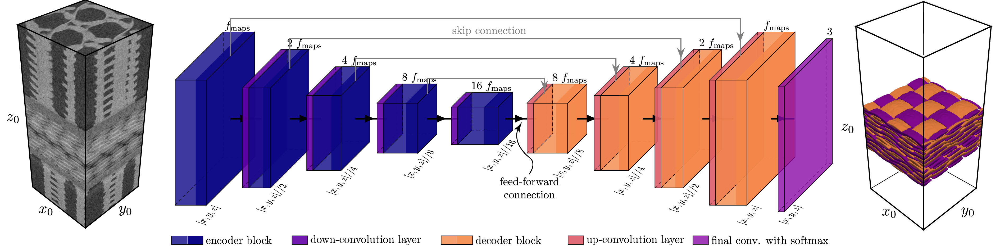

# 🩻 3Dseg for CT-Data

[](https://doi.org/10.5281/zenodo.15230978)


This repository builds upon the original [pytorch-3dunet](https://github.com/wolny/pytorch-3dunet.git) implementation by Wolny et al. We extended the codebase by adding functionality and integrating additional loss functions tailored for multi-class segmentation of textile reinforcements in low-resolution CT data.

The corresponding [paper]() and [preprint]() can be found here, and the dataset is available on [Zenodo](https://doi.org/10.5281/zenodo.15230978) as `*.h5` and `*.nrrd` files. Only the `*h5` files can be used for training. All other data mentioned in [paper]() or [preprint]() can be requested via <a href="mailto:christian.duereth@tu-dresden.de">mail</a>.




## 💿 Installation


### 🔥 PyTorch Compatibility

This repository is built with PyTorch, a Python-based, GPU-accelerated deep learning library. It leverages the CUDA toolkit for efficient computation on NVIDIA GPUs.

⚠️ Note: PyTorch’s Metal backend (for Apple M1/M2 chips) currently only supports up to 4D tensors. This means 5D inputs required for 3D convolutions (shape [batch, channel, depth, height, width]) are not supported on Metal GPU devices. Running on CPU still possible but not reccommended.

We strongly recommend using an NVIDIA GPU and installing the appropriate CUDA drivers for full functionality and performance.

### 📦 Installation Steps
1.	Clone the repository and navigate to it in your terminal. 
```bash
git clone https://github.com/choROPeNt/3dseg.git
cd 3dseg
```
Then run:

```bash
python -m pip install -e .
```
This should install the `3dseg` python package via PIP in the current active virtual enviroment. How to set up a virtual enviroment please refer to [virtual enviroment section](#virtual-enviroment)


## 🧠 HPC 

If you are using the High Performance Computing (HPC) cluster of the TU Dresden, we recommend using one of the GPU clsuters like `Alpha` (Nvidia A100 SXM 40 GB) or `Capella` (Nvidia H100). First, allocate some ressources e.g. for `alpha`
```bash
 srun -p alpha -N 1 -t 01:00:00 -c 8 --mem=16G --gres=gpu:1  --pty /bin/bash -l
```
You can use the following module setup (adjust as needed for your cluster’s module system):
```bash
ml release/24.04  GCC/12.3.0  OpenMPI/4.1.5 PyTorch-bundle/2.1.2-CUDA-12.1.1
```
afterwards, create a new virtual enviroment in directory:
```bash
python -m venv --system-site-packages .venv
```
It is important to set the flag `--system-site-packages` otherwise you dont have access to the prebuild pytorch package (recommended workaround).

Activate the enviroment via:
```bash
source .venv/bin/activate
```


## 🏋️‍♂️ Training
Model training is initiated using the train.py script and a corresponding YAML configuration file:

```bash
python scripts/train.py --config=<path-to-congig-yml>
```
The configuration file specifies model architecture, dataset paths, training hyperparameters, logging, and checkpointing options.
Example configurations can be found in the [configs](configs) folder. Each config file contains inline comments or is self-explanatory with regard to most parameters such as batch size, learning rate, data augmentation, loss functions, and optimizer settings.

During training, checkpoints are saved periodically, and training metrics are logged for visualization (e.g., via TensorBoard or custom loggers).


## 🤖 Prediction
To run inference using a trained model, use:
```bash
python scripts/predict.py --config=<path-to-congig-yml>
```
This will load the model from the checkpoint defined in the config file and perform prediction on the specified input data.

Please note that the choice of a padding (e.g. mirror) padding is recommended for better prediction on the edges. 

The model will output the prediction probabilities after choosen activation function (eg. sigmoid or softmax) for every channel. Please consider memory allocations and space on your hard drive, precition will save a `[c,z,y,x]` array as float32.

## Hyperparameter Optimization with OmniOpt

We employ OmniOpt, a hyperparameter optimization framework developed at TU Dresden, to tune model parameters for improved performance.
Integration into this project is currently under development, and future releases will include automated optimization workflows using OmniOpt.

Further information can be found here [Documematation OmniOpt](https://compendium.hpc.tu-dresden.de/software/hyperparameter_optimization/) or from [ScaDS.AI](https://scads.ai/transfer/software/omniopt/)


## 📊 Descriptor-based Evaluation

Currently the FFT-based 2-Point Correlation in PyTorch is available. For more higher dimensional descriptors we kindly revise to [MCRpy](https://github.com/NEFM-TUDresden/MCRpy) from the NEFM at TU Dresden. 


The FFT-based 2-Point correlation function is defined as follows:

$$ S_2(\mathbf{r}) = \frac{1}{N} \; \mathcal{F}^{-1} \left( \mathcal{F}(\mathbf{M}) \odot \mathcal{F}^*(\mathbf{M}) \right)$$

where 
- $x$ is your binary input (microstructure or phase)
- $\ast$ is convolution (autocorrelation)
- $\mathcal{F}$ and $\mathcal{F}^{-1}$ are FFT and IFFT
- $N$ is the total number of elements (for normalization)


<!-- ## losses

### Dice Loss
The DiceLoss $\mathcal{L}_{Dice}$ is defined as following
$$\mathcal{L}_{\text{Dice}} = \frac{2 \sum_i^N p_i g_i}{\sum_i^Np_i^2+\sum_i^N g_i^2}$$


### binary-corss entropy
- [Pytorch - BCEloss](https://pytorch.org/docs/stable/generated/torch.nn.BCELoss.html)

$$ \mathcal{L}_{\text{BCE}}(x,y) = \{ l_1,\dots,l_N\}^\top \quad l_N=-w_n \left[ y_n \; \log x_n + (1-y_N)\;\log (1-x_n)\right]$$

$\mathcal{L}_{\text{BCE}}$ over one batch is determined by

$$\mathcal{L}_{\text{BCE}}(x,y) = \left\{
\begin{array}{ll}
\frac{1}{N} \sum_i^N l_i & \text{if reduction = 'mean'} \\
\sum_i^N l_i & \text{if reduction = 'sum'} \\
\end{array}
\right.$$

### BCE-DiceLoss

linear combination of BCE and Dice loss

$$ $$

## training

```
python ./scripts/train.py --config <CONFIG>
```


[b,c,d,w,h] -> [b,3*c,d,w,h]

## support
### virtual enviroment

to create a virtual enviroment named `.venv` you may run
```bash
python -m venv .venv
````

to activate the virtual enviroment please run

- for linux and macos
```bash
source .venv/bin/activate
```

## Support and Advanced Installations
### HDF5 with MPI (macOS)
If you are using a macOS machine and want to access your results faster, it's reccommended to install HDF5 with MPI support.  

make sure you have installed HDF5 with MPI support. Otherwise you can install it using the Homebrew formula

```zsh
brew install hdf5-mpi
```

After a succefull installation you have to set the `PATH` variables for the compiler

```zsh
export CC=mpicc
export HDF5_MPI="ON"
export HDF5_DIR="/path/to/parallel/hdf5"  # If this isn't found by default
```
If you are unsure where the location of your HDF5-MPI binary is, you can find the `HDF5_DIR` with running

```
h5pcc -showconfig
```
In the case you have an 


Install the python package `h5py` with

```zsh
 % python -m pip install --no-binary=h5py --no-cache-dir h5py
```

the options `--no-binary=h5py` and `--no-cache-dir` that `pip` is forced to build the package from source via `wheel` -->